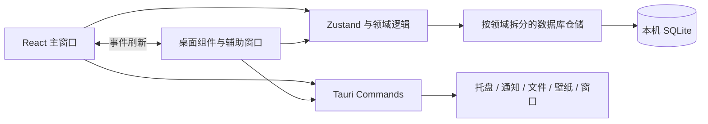

<p align="center">
  
</p>

<h1 align="center">日进·拾光 · Grow with Time</h1>

<p align="center">
  一款本地优先的个人行动与成长桌面应用。<br>
  把任务、专注、成长、生活记录与日常收支留在自己的电脑里。
</p>

<p align="center">
  <a href="https://github.com/xiaolongoba-java/Grow-with-Time/releases/latest">GitHub 下载</a>
  ·
  <a href="https://gitee.com/xiaolong-oba/grow-with-time/releases">Gitee 下载</a>
  ·
  <a href="./docs/PRODUCT_DECISIONS.md">产品决策</a>
  ·
  <a href="https://github.com/xiaolongoba-java/Grow-with-Time/issues">问题反馈</a>
</p>

> 当前源码版本：**v1.6.4**。核心数据保存在本机 SQLite 中，无需注册账号，也不依赖持续联网。

## 这是什么

日进·拾光不是一个只负责收集待办的清单，也不是多人协作项目管理工具。它希望完成一个更完整的个人闭环：知道今天要做什么，专注完成，妥善处理没有完成的事，再看见这些行动如何沉淀为长期成长。

产品由两条主线和两个辅助区域组成：

| 区域 | 解决的问题 | 包含内容 |
| --- | --- | --- |
| **日进** | 今天怎样向前一步 | 今日计划、任务、周清单、项目、习惯、专注、提醒、复盘、成长目标 |
| **拾光** | 今天有什么值得留下 | 今日拾光、拾念箱、拾光变迁、纪念日、备忘录 |
| **观流账本** | 钱在日常生活中流向哪里 | 收支明细、分类与账户、月度预算、趋势与桌面快捷记账 |
| **工具箱** | 保持桌面环境清爽 | 桌面收纳、快捷方式收纳篮、壁纸图库与自动轮换 |

观流账本属于“日进”侧的个人生活记录能力，不是一条独立的金融产品线；工具箱也与任务和记录主线保持分离。

## 从记录到成长

一个典型的使用循环是：

1. 通过侧栏、快速添加窗口或全局快捷键收集任务与灵感。
2. 在“今日”汇总今日计划、今天截止和已经逾期的事项。
3. 检查时间冲突，预览智能排程，从下一项任务开始专注。
4. 完成、顺延、移出今日或取消任务，并在晚间完成今日收尾。
5. 在今日拾光和周复盘中回看行动、心情、投入时间与目标进展。
6. 让任务、习惯和专注记录持续贡献到长期目标与年度热点图。

## 主要能力

### 今日执行与任务系统

- “今日”集中显示今日计划、今天截止和逾期任务，同一任务只出现一次。
- 支持优先级、状态、日期、起止时间、预计耗时、实际耗时和完成标准。
- 支持子任务、重复规则、多次提醒、前置依赖、精力等级与灵活排程。
- 智能排程先预览后应用；应用后的日期和时间会持久化锁定。
- 支持批量完成、改期、顺延、移出今日计划与回收站恢复。
- 自然语言快速录入，例如 `明天下午3点 开会 p1`。
- 任务历史、日快照和专注会话为复盘提供可靠的数据来源。

### 项目、模板与周清单

- 用项目组织任务，并记录项目目标、成功标准、颜色和截止日期。
- 项目里程碑支持日期、完成状态和内联编辑。
- 常用任务结构可以保存为模板，减少重复录入。
- 周清单按一周组织目标、每日任务与当周统计。
- 标签、搜索、筛选和智能列表用于建立自己的任务视图。

### 专注、习惯与提醒

- 任务可绑定番茄钟，专注时间自动累计到任务与关联成长目标。
- 专注计时使用绝对结束时间，电脑休眠或界面卡顿后仍按真实经过时间结算。
- 习惯支持每周目标、每日打卡、连续记录和成长目标关联。
- 倒计时适合会议和临时节点，循环提醒适合喝水、活动和护眼。
- 任务支持单次或多组提前提醒，并同时写入通知中心。
- Windows 与 macOS 会把最近 **48 条、90 天内**的提醒登记到系统队列；其余提醒在应用运行时继续调度。
- 关闭主窗口会驻留系统托盘；完全退出后，只有已经交给操作系统托管的提醒仍可能弹出。

### 长期成长与复盘

- 长期目标支持累计数量、数值变化、持续频率、累计时间、关联项目和自定义记录。
- 任务完成、习惯打卡与专注时间可以按目标类型自动贡献进度。
- 年度热点图展示过去一年的投入，并可点击具体日期回看记录。
- 目标支持暂停、恢复、完成、放弃、归档、手动记录和阶段里程碑。
- 达成目标或里程碑后可自动生成成就，也可手动记录重要成果。
- 周复盘汇总七日任务节奏、长期目标投入和最近的拾光记录。

### 拾光记录

四类记录各有明确边界：

- **拾念**：记录一闪而过的想法，支持 `#标签`，可以转为任务。
- **今日拾光**：记录当天的收获、心情、最想留住的瞬间和写给明天的话。
- **备忘录**：保存需要长期查阅的内容，支持富文本与 Markdown、搜索、置顶和归档。
- **拾光变迁**：把一封信封存到未来某个时间；到期后在应用中送达。
- **纪念日**：支持公历、农历、每年重复与近 30 天提醒。

### 观流账本

- 记录收入和支出，按日期查看明细，并支持编辑与软删除。
- 内置常用收支分类和账户，也可管理启用状态。
- 查看本月结余、收入、支出、分类构成与近六个月趋势。
- 设置当月预算或以后月份的默认预算。
- 支持单独隐藏金额，也会响应全局无痕模式。
- 可使用全局快捷键打开“记一笔”，也可直接在桌面仪表盘完成快捷记账。
- 账本数据完整包含在 JSON 备份中。

账本面向个人日常收支，不提供共享账本、银行同步、投资组合、资产行情或财务建议。

## 桌面体验

### 两种桌面组件模式

| 模式 | 内容 | 适合场景 |
| --- | --- | --- |
| **横条仪表盘** | 问候与日期、备忘、习惯、纪念日、月历、倒计时、账本摘要、时光便签 | 希望在一条横向组件中总览当天状态 |
| **经典三件套** | 独立月历、今日计划、桌面备忘录 | 希望自由摆放和缩放不同组件 |

桌面组件支持：

- 深色配色、云雾浅色、自定义颜色和透明度调整。
- “贴窗口底层”与“始终置顶”两种层级。
- 点击任务、日期、纪念日、倒计时或账本区域跳转到主程序对应页面。
- 多窗口数据变更通知；在主程序或组件中修改内容后，其余窗口会同步刷新。
- 横条仪表盘中的账本摘要、月预算进度、最近流水与快捷记账。

> 桌面组件由普通 Tauri 窗口承载。项目明确不使用 Explorer WorkerW 或独立宿主来实现桌面层固定，因此不承诺按下 Windows `Win + D` 后组件仍持续显示。

### 其他桌面能力

- 无边框主窗口、系统托盘、开机自启和应用内命令面板。
- 独立快速添加、拾念、通知和专注倒计时浮窗。
- 桌面收纳会先预览，再把桌面顶层文件移入“日进收纳”分类目录；不递归、不覆盖，并支持撤销上一次整理。
- 快捷方式收纳篮用于集中打开桌面入口。
- 壁纸图库支持 JPG、PNG、BMP，支持手动切换、顺序或随机自动轮换。
- 主界面提供清昼、晨曦玻璃、璃幕、静夜四套视觉主题，并可跟随系统切换。

## 默认快捷键

所有快捷键都可以在“设置 → 全局快捷键”中启停、改绑和恢复默认值。

| 操作 | 默认快捷键 | 作用范围 |
| --- | --- | --- |
| 快速新建任务 | `Ctrl/⌘ + Shift + N` | 全局 |
| 拾念 | `Ctrl/⌘ + Shift + Space` | 全局 |
| 快速记一笔 | `Ctrl/⌘ + Shift + B` | 全局 |
| 命令面板 | `Ctrl/⌘ + K` | 主窗口 |

## 数据、隐私与安全

| 项目 | 当前实现 |
| --- | --- |
| 数据存储 | 本机 SQLite 数据库 `app.db`，启用 WAL 与外键 |
| 账号与遥测 | 不要求账号；默认不上传任务、账本、日志或使用数据 |
| 多窗口写入 | JavaScript 写队列配合 Web Locks，降低多个 WebView 同时写库的冲突 |
| 自动备份 | 默认每 6 小时导出一份 JSON，保留最近 10 份 |
| 启动快照 | 启动和恢复前创建数据库快照，保留最近 10 份，可在设置中恢复 |
| 手动迁移 | 可导出完整 JSON、导入恢复，也可导出任务 CSV |
| 隐私模式 | 模糊任务和记录标题、隐藏账本金额、让系统通知不展示具体内容 |
| AI | 默认关闭；只在用户填写 OpenAI 兼容 API 后用于任务拆解和排期建议 |
| 窗口权限 | 主窗口拥有完整能力；组件与快速捕获窗口不具备 HTTP、备份导出等高权限 |

JSON 备份格式当前为 **v8**，覆盖任务、标签、附件、习惯、项目、模板、提醒、专注记录、成长、拾光、纪念日和观流账本。API Key 被视为凭据，不会写入便携备份。

如启用 AI，相关任务内容会发送到你配置的服务端。主窗口的 HTTP 权限仅允许 HTTPS 地址，或本机 `localhost` / `127.0.0.1` HTTP 地址。

最稳妥的数据管理方式是：保持自动备份开启，并定期把手动导出的 JSON 复制到另一个磁盘或可信的个人同步目录。数据目录的实际位置可以在“设置 → 数据备份 → 打开数据目录”中查看。

## 下载与安装

当前发布版本为 **v1.6.4**：

- [GitHub Releases（最新版）](https://github.com/xiaolongoba-java/Grow-with-Time/releases/latest)
- [Gitee Releases（国内镜像）](https://gitee.com/xiaolong-oba/grow-with-time/releases)

| 平台 | 当前提供的安装包 | 说明 |
| --- | --- | --- |
| Windows x64 | NSIS `.exe` | 面向 Windows 10/11；安装包不捆绑或联网下载 WebView2 |
| macOS Apple Silicon | `.dmg` | 面向 M1/M2/M3/M4；当前使用 ad-hoc 签名，尚未公证 |

Windows 10/11 通常已经随 Microsoft Edge 安装 WebView2 Runtime。极少数精简系统若无法启动，请先安装 [Microsoft Edge WebView2 Runtime](https://developer.microsoft.com/microsoft-edge/webview2/)。当前 Windows 安装包未购买代码签名证书，浏览器或 SmartScreen 可能显示未知发布者警告，请只从上面的项目发行页下载安装。

macOS 首次打开若被 Gatekeeper 阻止，请前往“系统设置 → 隐私与安全性”允许打开。当前没有提供 Intel Mac 的正式构建。

历史变化、升级提示与安装包校验以 [GitHub Releases](https://github.com/xiaolongoba-java/Grow-with-Time/releases) 中对应版本的说明为准，不再把完整发布日志堆叠在 README 中。

## 已确认的产品边界

- 面向个人，不提供团队空间、成员权限、审批或在线协作。
- 本地优先，不提供官方云同步或远程数据托管。
- 数据库只支持向前迁移；升级后的数据库不保证能被旧版本正确打开。
- 正式发布的 migration 不删除、不重排、不改写，只追加更高版本。
- 不承诺 Windows `Win + D` 后桌面组件仍显示。
- 观流账本不接入银行、证券或投资服务。
- Karma 游戏化积分已经退出产品范围；成长以真实任务、习惯、专注和目标投入呈现。

详细背景与验收标准见 [产品需求与决策记录](./docs/PRODUCT_DECISIONS.md)。

## 技术栈

| 层次 | 技术 |
| --- | --- |
| 桌面框架 | Tauri 2、Rust 2021 |
| 前端 | React 19、TypeScript 5.8、Vite 6 |
| 状态与交互 | Zustand、dnd-kit、TanStack Virtual |
| 本地数据 | SQLite、tauri-plugin-sql |
| 文本与日期 | react-markdown、remark-gfm、lunar-typescript |
| 系统集成 | 托盘、通知、全局快捷键、自启、文件对话框、壁纸与桌面文件操作 |
| 测试 | Vitest、Happy DOM、Rust `cargo check` |

## 开发环境

建议使用与 CI 一致的 **Node.js 22** 和最新稳定版 Rust。

平台依赖：

- Windows：Visual Studio Build Tools（MSVC）、Windows SDK，以及 WebView2 Runtime。
- macOS：Xcode Command Line Tools；构建 DMG 需要在 macOS 上执行。
- Linux：代码包含部分兼容实现，但当前没有官方安装包，不能视为正式支持平台。

安装依赖并启动桌面开发环境：

```bash
npm ci
npm run tauri dev
```

只启动浏览器前端通常不足以验证本项目，因为数据库、窗口、系统提醒、文件系统和托盘能力依赖 Tauri 运行时。

### 常用命令

```bash
# 前端开发服务器
npm run dev

# TypeScript 检查并构建前端
npm run build

# 运行全部前端测试
npm test

# 检查 Rust 端
cargo check --manifest-path src-tauri/Cargo.toml

# 发布前完整门禁：版本检查 + cargo check + 测试 + 前端构建
npm run release:check

# 构建当前平台安装包
npm run tauri build
```

如果 Windows 上出现 Git 自带 `link.exe` 与 MSVC 链接器冲突，可复制 `src-tauri/.cargo/config.toml.example` 为 `src-tauri/.cargo/config.toml`，并指向本机 MSVC 的 `link.exe`。该本地配置已经被 `.gitignore` 忽略。

## 项目结构

```text
src/
├─ app/                 # 主窗口、快捷捕获、提醒、组件等窗口入口
├─ components/          # 今日、成长、拾光、账本、设置等业务视图
├─ store/               # Zustand 应用状态与跨模块编排
├─ lib/
│  ├─ db/               # 按领域拆分的 SQLite 读写层
│  └─ *.ts              # 排程、提醒、备份、隐私、桌面工具等领域逻辑
└─ styles/parts/        # 分层样式与主题覆盖

src-tauri/
├─ src/lib.rs           # 应用启动、窗口、托盘、备份、迁移和命令注册
├─ src/os_reminders.rs  # Windows / macOS 原生提醒
├─ src/desktop_organize.rs
├─ src/wallpaper.rs
├─ capabilities/        # 按窗口划分的 Tauri 能力边界
└─ tauri.conf.json      # 窗口、打包、安全策略与插件配置

scripts/                # 发布检查、安装素材和 Gitee 同步脚本
docs/                   # 产品决策与长期维护文档
```

### 运行架构



前端入口会根据 Tauri 窗口标签按需加载不同应用外壳。桌面组件和快速捕获窗口只获得完成自身职责所需的权限，不继承主窗口的完整 HTTP、文件导出和全局快捷键能力。

## 数据库与升级约束

当前 schema migration 已到 **24**，采用追加式升级策略：

- 已经发布的 migration 内容必须保持不可变。
- 新字段或新表通过更高编号 migration 添加。
- SQLite 写入使用 WAL、`busy_timeout`、进程内队列和 Web Locks 降低跨窗口争用。
- 导入 JSON 前会创建数据库快照；导入失败时通过待恢复标记回滚并重启。
- 如需回退旧版本，应先导出 JSON，再卸载并清理不兼容数据库；不要直接让旧版打开已经升级的数据文件。

涉及 schema、备份或跨窗口数据写入时，至少运行 migration、backup、privacy 和 desktop widget 相关测试；发布前统一运行 `npm run release:check`。

## 构建与发布

Windows NSIS：

```bash
npm run tauri build -- --bundles nsis
```

macOS Apple Silicon：

```bash
npm run tauri build -- --target aarch64-apple-darwin --bundles app,dmg
```

仓库中的 GitHub Actions 会在 `v*` 标签或手动触发时构建 Windows x64 与 macOS Apple Silicon 安装包，执行发布门禁，并上传构建产物。配置 `GITEE_TOKEN` 后还会同步安装包到 Gitee Release。

发布版本号需要同时保持以下位置一致：

- `package.json`
- `src-tauri/Cargo.toml`
- `src-tauri/tauri.conf.json`
- README 中的当前版本说明

## 参与贡献

欢迎提交 Issue 或 Pull Request。开始开发前请先阅读 [产品需求与决策记录](./docs/PRODUCT_DECISIONS.md)，避免重新引入已经放弃的方向。

提交前请确认：

1. 变更没有破坏本地优先和窗口最小权限原则。
2. 数据库变更使用新 migration，没有修改历史 migration。
3. 新增数据进入完整 JSON 备份，并补充相应测试。
4. 用户可见功能、快捷键或平台限制已经同步到 README 或 Release Notes。
5. `npm run release:check` 全部通过。

## License

本项目采用 [Apache License 2.0](./LICENSE)。
